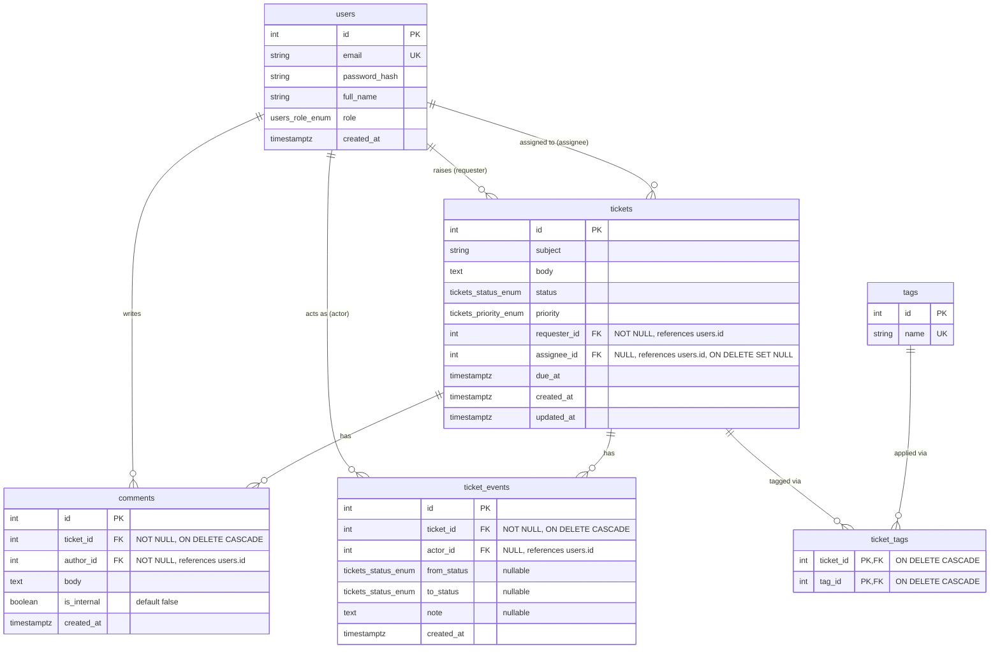

# Support Desk — Entity Relationship Diagram

## Cardinality notes

- `users → tickets` (requester): **mandatory** on the ticket side — every ticket has exactly one requester, and a user may have raised many tickets or none. `requester_id` is `NOT NULL`.
- `users → tickets` (assignee): **optional** — a ticket may be unassigned. `assignee_id` is nullable, `ON DELETE SET NULL` (if the assigned agent is ever removed, the ticket becomes unassigned rather than being deleted).
- `tickets → comments`: mandatory, `ON DELETE CASCADE` — deleting a ticket deletes its comments.
- `tickets → ticket_events`: mandatory, `ON DELETE CASCADE` — deleting a ticket deletes its audit trail with it.
- `tickets ↔ tags` via `ticket_tags`: many-to-many, composite primary key `(ticket_id, tag_id)`, both sides `ON DELETE CASCADE`.
- `ticket_events.actor_id`: **nullable** — reserved for a system-generated event with no human actor; in practice every event in this app has an actor.
